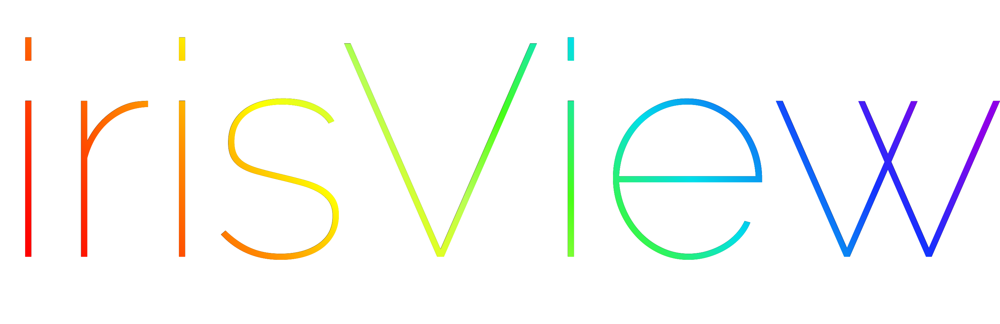
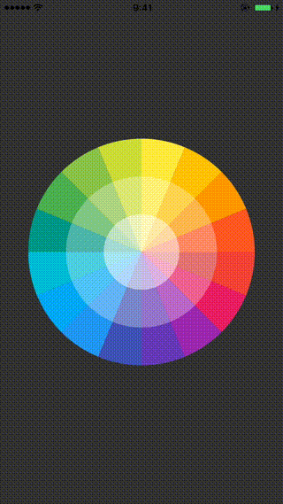

# irisView



[](https://travis-ci.org/ozwio/irisView)
[](http://cocoapods.org/pods/irisView)
[](http://cocoapods.org/pods/irisView)
[](http://cocoapods.org/pods/irisView)

## Features

- [X] Pure Swift 3.
- [X] Beautiful Colorful Picker.



## Setup
```swift
import irisView
```
```swift
let colorPicker = irisView(frame: CGRect(x: 0, y: 0, width: pickerWidth, height: pickerHeight))
```
```swift
colorPicker.colors = [UIColor.red, UIColor.blue, ...]
colorPicker.center = CGPoint(x: view.frame.width/2, y: view.frame.height/2)
colorPicker.radius = pickerWidth/2
colorPicker.isShadowed = true
view.addSubview(colorPicker)
```

```swift
override func touchesBegan(_ touches: Set<UITouch>, with event: UIEvent?) {
        colorPicker.detect(touches, with: event)
}

override func touchesMoved(_ touches: Set<UITouch>, with event: UIEvent?) {
        colorPicker.detect(touches, with: event)
}

override func touchesEnded(_ touches: Set<UITouch>, with event: UIEvent?) {
        colorPicker.detect(touches, with: event, end: true)
}
```

## Example

To run the example project, clone the repo, and run `pod install` from the Example directory first.

To get the selected picker, add this code.
```swift
override func touchesBegan(_ touches: Set<UITouch>, with event: UIEvent?) {
        colorPicker.detect(touches, with: event)

        do {
        	let obj = try colorPicker.detected()
        	print("i: \(obj.0), layer: \(obj.1)")
        } catch {}
}
```

## Requirements

## Installation

irisView is available through [CocoaPods](http://cocoapods.org). To install
it, simply add the following line to your Podfile:

```ruby
pod 'irisView'
```

## Author

ozwio, ozwio.me@gmail.com

## License

irisView is available under the MIT license. See the LICENSE file for more info.
